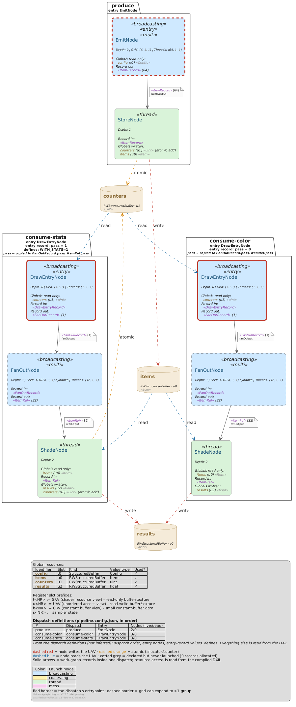

> **⚠️ LLM-GENERATED CONTENT:** This whole project was LLM (Claude Sonnet 5, later extended with Claude Opus)
> generated by iteratively prompt-review cycling the result. None of the code or any of the documentation was
> written by hand. REVIEW THE CODE AND ITS BEHAVIOR BEFORE RELYING ON IT. This tool is just shared so you can
> easily reuse it without burning the tokens yourself.

# hlsl-workgraph-diagram

Reverse-engineer a Direct3D 12 [Work Graph](https://microsoft.github.io/DirectX-Specs/d3d/WorkGraphs.html) from
HLSL and render it as [PlantUML](https://plantuml.com/) diagrams (plus PNG/SVG): the node graph, the record
struct layouts, and - from a short list of dispatch definitions - a whole frame of `DispatchGraph` calls with the
data they hand to each other through UAVs. A `validate` command checks the result against the Work Graphs spec's
limits and for data-flow mistakes.

No dependencies. Node.js built-ins only (`fs`, `path`, `zlib`, `http`, `https`, `child_process`). Rendering
needs either a PlantUML server or a local `plantuml.jar` (Java + Graphviz).



*`examples/multi-dispatch`: one producer dispatch and two dispatches of the same consumer entry with different
entry records, the second compiled with an extra `#define`. Everything except the three dispatch definitions is
read from the compiled DXIL.*

## Quick start

The recommended way: write a small **dispatch definition** file and run the `pipeline` command. It compiles the
graph with `dxc`, and writes per dispatch a graph and a record-layout diagram, a merged frame diagram of all
dispatches, and a validation report.

```json
{
  "source": "shaders/WorkGraph.hlsl",
  "compile": { "profile": "lib_6_8", "defines": [] },
  "diagram": { "lineType": "spline", "short": true, "nodeComments": false },
  "dispatches": [
    { "name": "produce", "entry": "EmitNode" },
    { "name": "consume", "entry": "DrawEntryNode", "entryRecord": { "pass": 0 } }
  ]
}
```

```sh
hlsl-workgraph-diagram setup-dxil mesh                                  # once: fetch a dxc build (or set compile.dxc)
hlsl-workgraph-diagram pipeline workgraph.config.json out/ --jar plantuml.jar   # or --server <url>
```

`out/frame.svg` is the merged frame; `out/NN-<dispatch>.graph.svg` and `.records.svg` are the per-dispatch
views; `out/validation.txt` is the report. See [`docs/pipeline.md`](docs/pipeline.md) for every config field.

For a single graph without dispatch definitions, run the commands individually:

```sh
hlsl-workgraph-diagram parse-dxil shaders/WorkGraph.hlsl graph.ir.json --profile lib_6_8
hlsl-workgraph-diagram build-puml graph.ir.json graph.puml        # node graph
hlsl-workgraph-diagram build-records graph.ir.json records.puml   # record struct layouts
hlsl-workgraph-diagram validate graph.ir.json                     # spec limits + data-flow checks
hlsl-workgraph-diagram puml-render graph.puml --jar plantuml.jar  # or --server <url>
```

## Install

```sh
npm install -g hlsl-workgraph-diagram
# or
yarn global add hlsl-workgraph-diagram
```

Or run it without installing:

```sh
npx hlsl-workgraph-diagram <command> [args...]
# or
yarn dlx hlsl-workgraph-diagram <command> [args...]
```

Run `hlsl-workgraph-diagram --help` for the command list, `hlsl-workgraph-diagram <command> --help` for a
command's own options, and `--version` (or `-v`) for the installed version.

## How it works

The tool is a set of small commands around one JSON intermediate representation (the **IR**,
[`docs/ir-format.md`](docs/ir-format.md)):

```
                    ┌──────────────┐
   HLSL source ───▶ │ parse-source │ ─┐                  ┌─▶ build-puml    ─▶ graph / frame .puml ─┐
   (regex scan)     └──────────────┘  │                  │                                         │
                                      ├─▶  IR JSON  ─────┼─▶ build-records ─▶ records .puml ───────┼─▶ puml-render ─▶ .png/.svg
                    ┌──────────────┐  │                  │                                         │   (--jar or --server)
   HLSL source ───▶ │  parse-dxil  │ ─┘                  └─▶ validate      ─▶ PASS/WARN/FAIL report│
   (dxc compile)    └──────────────┘                                                               │
                          ▲                    pipeline = all of the above, per dispatch definition ┘
                    ┌──────────────┐
                    │  setup-dxil  │   (fetches dxc, once)
                    └──────────────┘
```

- **`parse-source`** - a regex/paren-balance scan over the raw HLSL, no real preprocessor. Needs nothing
  installed; gives the graph topology only.
- **`parse-dxil`** - compiles the HLSL with `dxc` and reads everything back out of the compiled DXIL: the graph
  from the node metadata, names and struct layouts from the debug info, and - by analysing the compiled code -
  which buffers each node reads and writes, which record fields it reads and where the values it writes come
  from. `#define`s, `#if` and dead-code elimination are handled for free, because it is the real compiler. Needs
  `dxc` and a single `.hlsl` file that `#include`s everything the graph needs. **All features beyond the plain
  graph (globals read/written, record layouts, dataflow checks, the pipeline) need this parser.**

Both parsers write the same IR shape; `build-puml` renders either. The optional analysis fields exist only in a
`parse-dxil` IR, and every renderer and check degrades gracefully without them.

## What is inferred, and what you supply

Everything in the diagrams is read from the compiled DXIL - its metadata, its code, its debug info, and the source
text `dxc` embeds with `-Zi` (for comments, constant names and parameter names) - except what only the host
application knows. That comes from files you write:

| Input | Supplies | Needed for |
| --- | --- | --- |
| compile settings (`--profile`, `--define`, `--dxc-arg`, or the config's `compile`) | which code gets compiled | everything; match what your app compiles |
| **dispatch definitions** (`pipeline` config) | frame order, entry node, entry-record values, per-dispatch `#define`s | the frame diagram, cross-dispatch checks |
| dispatch plan (`--dispatches plan.json`, optional) | the same, plus programs, bindings, render-target flows, rules - [`docs/dispatch-plan.md`](docs/dispatch-plan.md) | a richer frame; `--dispatches auto` infers one dispatch per entry instead |
| record annotations (`--annotations`, optional) | the *role* of a field the compiler cannot name (e.g. "pass identity") | extra notes on the records diagram |

Diagrams say where supplied information came from: the frame legend lists what the definitions set, and
annotated record fields are tagged `(annotation)` next to the `(DXIL)` tags of inferred facts. Plans and
annotations are plain JSON - write them by hand or generate them, the tool never needs them.

## The diagrams

### Node graph (`build-puml`)

One box per node: launch mode (colour), entry (red border), depth, dispatch grid and thread-group size (with
`#define` names resolved), then **Globals read only**, **Record in**, **Globals written** (tagged `read`,
`atomic <op>`, `globallycoherent` where they apply), **Barriers**, and **Record out**. Edges carry the record
type, `MaxRecords` and output parameter name. A dotted edge is **statically dead** (every allocation on it is the
literal 0) and a greyed node reachable only through dead edges is **never launched**.

### Frame (`build-puml --dispatches`, or `pipeline`'s `frame.puml`)

One package per dispatch, in order, each holding the subgraph reachable from its entry, with its entry record and
what each entry-record field reaches (branches it decides, output counts it affects, record fields it is copied
into). Every UAV any node touches gets one box, with dashed edges between dispatches: red = write, orange =
atomic, blue = read. `--hide-global <name>` leaves a noisy resource out (noted in the legend).

### Record layouts (`build-records`)

Every record that crosses a node edge, every buffer element type, and every struct nested in them, as a class
diagram: `size  offset  type  name` per field, grouped into entry records (written by the CPU), node records,
buffer element types and nested structs, with composition arrows for nested structs. Highlighted, all inferred:

- **SV_DispatchGrid** (from the node metadata, with the values it is computed from);
- fields that **index a buffer** - the value reaches a buffer access's index, directly or after being copied into
  another record's field (e.g. `firstQuad → quadBuffer[]`);
- fields that **affect an output's allocation count**, fields that **decide control flow** in a node;
- fields **written but never read** by any node, and implicit **padding**.


*`examples/multi-dispatch`, dispatch `consume-color`. Read a row as `size offset type name`: `FanOutRecord` is 20
bytes, its first field `DispatchGrid` is a 12-byte `uint3` at offset 0 and is the record's SV_DispatchGrid - taken
from the node metadata, with its value computed from the `counters` buffer. `ItemRef.index` (4 bytes at offset 0)
indexes `items[]` and `results[]`; `FanOutRecord.count` affects how many records `FanOutNode` emits to `ShadeNode`.
`DrawEntryRecord` is the entry record the CPU passes to `DispatchGraph`; `Item` is the element type of the `items`
buffer. Every highlight is marked `(DXIL)`: inferred from the compiled shader.*

`--style yaml` renders the same content as a PlantUML YAML diagram. For a single IR, run
`build-records graph.ir.json records.puml`; the pipeline writes one records diagram per dispatch.

### Line styles

`--line-type spline` (default, curved), `polyline` (straight segments) or `ortho` (right angles) on
`build-puml`/`build-records`; the pipeline's `diagram.frameLineTypes` renders the frame once per style. For
dense graphs `spline` is usually the most readable - `ortho` bundles many edges along the same channels.

## Validation (`validate`)

One line per check, `PASS`/`WARN`/`FAIL`/`INFO`; exit code 1 on any `FAIL`.

- **Spec node limits** (DXC checks none of these; only `CreateStateObject` does): `MaxRecords <= 256` and
  `MaxOutputSize <= 32 KB` for broadcasting/coalescing nodes, `<= 8` / `<= 128 B` for thread launch, the 48 KB
  combined rule including groupshared memory, graph depth `<= 32`.
- **Edges**: producer and consumer agree on the record type and byte size; no orphan nodes; mesh nodes are
  leaves; statically dead edges (`WARN`).
- **Record layouts**: debug-info size equals the DXIL record size; the source's `: SV_DispatchGrid` matches the
  metadata; per edge, every record element the consumer reads is stored by the producer on at least one path
  (element and component level - **not path-sensitive**: a field written on one branch and not on another is not
  caught); fields written but never read.
- **Frames** (with `--dispatches` or in the pipeline): entries exist and are `[NodeIsProgramEntry]`; entry-record
  values name real fields of the entry's input record; every node is part of some dispatch; a plain read of a UAV
  is preceded by a write in an earlier dispatch; a read next to a write of the same UAV in one dispatch (needs
  `globallycoherent` + a device-scope barrier) and a read next to atomics are flagged.
- **Runtime inventory** (`--inventory <log>`): every IR node and entry appears in the app's `[WorkGraph]` startup
  listing; runtime-only nodes (host-side renames) are reported.

## Command reference

Run `<command> --help` for the exact, current list.

**`pipeline <config.json> [outDir]`** - see [`docs/pipeline.md`](docs/pipeline.md).

| Flag | Description |
| --- | --- |
| `--jar <plantuml.jar>` | Render every diagram locally (implies rendering). |
| `--server <url>` | Render via this PlantUML server (implies rendering). |
| `--render` | Render via the default public server. |

**`setup-dxil`** (one positional argument, not a flag):

| Argument | Description |
| --- | --- |
| `stable` | Latest published version with no prerelease tag. Default when no argument is given. |
| `mesh` | The one `dxc` build currently known able to compile a `[NodeLaunch("mesh")]` node - a pinned, known-good version (see `docs/ir-format.md`), not "whatever's newest". |
| `experimental` | Latest published version *with* a prerelease tag - whatever that currently is (historically the same build `mesh` pins to, but not guaranteed to stay that way). |
| `<version>` | An exact version string (e.g. `1.9.2607.13`). |
| `list` | Print every version NuGet has published for this package, without downloading anything - annotates which are cached locally and which version `mesh`/`stable`/`experimental` currently resolve to. |

**`parse-dxil [entryHLSLFile] [outJsonFile]`**:

| Flag | Default | Description |
| --- | --- | --- |
| `--profile <lib_6_N>` | `lib_6_8` | dxc target profile; use the one your app compiles with. |
| `--define KEY=VALUE` | - | Preprocessor define (`-D`). Repeatable. |
| `--dxc-arg <arg>` | - | Extra dxc argument, verbatim (e.g. `-enable-16bit-types`). Repeatable. |
| `--entry NAME` | every node | Restrict the compile to this node's export (`-exports`). Repeatable. |
| `--dxc <path>` | - | Use this `dxc` binary (on Linux a native build works directly; `dxc.exe` runs natively on Windows, via `wine` elsewhere). |
| `--dxc-version <mesh\|stable\|experimental\|version>` | auto | Use a `dxc` installed by `setup-dxil`. Auto-detection scans only the entry file for `NodeLaunch("mesh")`. |
| `--keep-intermediate` | off | Keep the `.dxil` and `-Fc` disassembly in the working directory. |
| `--paths-relative-to <dir>` | - | Write source paths in the IR relative to `<dir>` (for committing IRs). |
| `--from-disassembly <file.dis.ll>` | - | Parse an existing disassembly instead of compiling (see below). |

**`build-puml [inJsonFile] [outPUml]`**:

| Flag | Default | Description |
| --- | --- | --- |
| `--dispatches <plan.json\|auto>` | - | Render the frame view instead of the single graph. |
| `--hide-global <name>` | - | Frame view: leave this resource out. Repeatable. |
| `--line-type <spline\|ortho\|polyline>` | `spline` | Edge routing. |
| `--short` | off | All four `--short-*` flags: resolved numbers only, compact meta line. |
| `--short-record-out-count` / `--short-record-in-count` / `--short-grid-threads-count` / `--short-meta` | off | The individual parts of `--short`. |
| `--node-comments` / `--no-node-comments` | on | Show each node's leading source comment. |
| `--global-list` / `--no-global-list` | on | Show the globals lists in node boxes. |
| `--global-fields` | off | Append the element fields each global is read/written through. |
| `--global-boxes` | off | Single-graph view: a box per global with edges into its readers. |
| `--edge-label` / `--no-edge-label` | on | Record note on each edge. |
| `--edge-record-size` | off | Add each record's byte size to its edge note. |
| `--record-in-names` / `--record-out-names` | off | Parameter names next to record types (parse-source IRs only). |
| `--dark` / `--light` | light | Colour theme. |

**`build-records [inJsonFile] [outPUml]`** (parse-dxil IR):

| Flag | Default | Description |
| --- | --- | --- |
| `--style <class\|yaml>` | `class` | Class diagram or YAML diagram. |
| `--line-type <spline\|ortho\|polyline>` | `spline` | Class style edge routing. |
| `--columns <n>` | `4` | Class style: boxes per row within a group. |
| `--roles <list>` | all | Subset of `cpu-entry-record,node-record,buffer-element,nested`. |
| `--comments` / `--no-comments` | on | Show each field's source comment. |
| `--annotations <file.json>` | - | Optional field roles, tagged `(annotation)`. |

**`validate [inJsonFile]`**:

| Flag | Description |
| --- | --- |
| `--dispatches <plan.json\|auto>` | Also check a frame (entries, entry records, cross-dispatch flow). |
| `--inventory <file>` | Compare against the app's `[WorkGraph]` startup lines. |
| `--annotations <file.json>` | Check annotations name real fields/resources; index claims against the dataflow. |
| `--json <file>` | Also write the results as JSON. |

**`puml-render [pUmlFile]`**:

| Flag | Default | Description |
| --- | --- | --- |
| `--jar <plantuml.jar>` | - | Render locally (Java + Graphviz); nothing leaves the machine. Fails on a PlantUML syntax error. |
| `--server <url>` | `https://www.plantuml.com/plantuml` | PlantUML server to render with (ignored with `--jar`). A local one: `java -jar plantuml.jar -picoweb:8080`. |
| `--scale <n>` | `2` | `scale` directive inserted at render time; the `.puml` on disk is untouched. |

**`parse-source [rootSourceDir] [outJsonFile]`** scans every `nodes-*` directory under `rootSourceDir` for
`[Shader("node")]` functions. **Every command**: `--help` / `-h` / `-?`; most take `--verbose` / `-v`.

## Generating the disassembly yourself

`parse-dxil --from-disassembly` lets you skip the compile step entirely - useful if you want to run `dxc`
somewhere this tool doesn't control (a different machine, a custom build, extra flags), or just to reuse a
disassembly you already have from `--keep-intermediate`. Compile with exactly this, and hand the resulting
`-Fc` file to `--from-disassembly`:

```sh
dxc -T lib_6_8 -Zi -Qembed_debug -Vd -Fo out.dxil -Fc out.dis.ll YourEntryFile.hlsl

hlsl-workgraph-diagram parse-dxil --from-disassembly out.dis.ll work-graph.ir.json
```

- `-T lib_6_8` - required target profile for work graphs.
- `-Zi -Qembed_debug` - **not optional**: this is what embeds the original per-file source (comments,
  un-expanded `#define` names, doc comments) into the compiled container, which `parse-dxil` depends on for
  everything beyond the bare DXIL metadata (comments, original attribute expressions, record parameter
  variable names). Omit it and those fields all come back `null`.
- `-Vd` - skips the container validator. Omit it if your `dxc` build ships `dxil.dll` and you want the
  compiled container validated (doesn't affect what `parse-dxil` can read either way).
- `-Fc out.dis.ll` - the file to hand to `--from-disassembly`. `-Fo out.dxil` (the compiled container
  itself) isn't read by this tool at all - only the disassembly is - but `dxc` still requires `-Fo` to be
  given alongside `-Fc`.
- Add `-D KEY=VALUE` for preprocessor defines, `-exports NAME` to restrict the compile to one node, exactly
  as `--define`/`--entry` would have passed them through.

## Examples

Three minimal, runnable work graphs live under [`examples/`](examples/), each with `src/` (the HLSL), `gen/` (the
tool's output) and a `README.md` with the exact commands to reproduce `gen/`:

- [`examples/simple-pipeline/`](examples/simple-pipeline/) - the three main launch modes chained together
  (`broadcasting` → `thread` → `coalescing`); both parsers side by side, plus its record layouts.
- [`examples/mesh-culling/`](examples/mesh-culling/) - a `mesh`-launch node with a runtime dispatch grid, reading a
  global `StructuredBuffer`; both parsers side by side, plus its record layouts (an SV_DispatchGrid record).
- [`examples/multi-dispatch/`](examples/multi-dispatch/) - the `pipeline`: a producer dispatch filling UAVs and two
  consumer dispatches of the same entry, with entry records and a per-dispatch `#define` (the image at the top),
  and a records diagram per dispatch (the image under "Record layouts").

## Rendering notes

`puml-render --server` sends the `.puml` source (function names, record types, resolved constant values, global
resource names/slots, and any extracted doc comments) to a PlantUML server - the public
`https://www.plantuml.com/plantuml` unless another URL is given. **`--jar <plantuml.jar>` renders locally instead,
so nothing leaves your machine** (needs Java and Graphviz), and it has no server size limits beyond
`PLANTUML_LIMIT_SIZE`, which it raises to 16384. `build-puml`'s `.puml` output never depends on either.

The public PlantUML server has been observed to fail on sufficiently complex diagrams generated by this
tool - it returns an empty `200 text/plain` response instead of an image, and that failure can then be
cached at the edge for a while, so retrying the identical request doesn't help. This is a limitation of the
public server/CDN, not a bug in the generated `.puml`. If you hit it:

- point `--server` at a local or self-hosted PlantUML server (a plain PlantUML webapp works fine), or
- fall back to `--short --no-edge-label` on `build-puml` to reduce the diagram's rendered complexity.

The `.puml` output from `build-puml` is always valid regardless of which option you pick - only the
convenience PNG/SVG render is affected.

**PNG output can be silently cropped** by the PlantUML server's own pixel-size limit (commonly
`PLANTUML_LIMIT_SIZE`, defaulting to 4096px per dimension) - a large diagram, or a smaller one at a high
`--scale`, can come back as a `.png` that's cut off rather than an error. This is a server-side limit, not
something this tool controls or can raise. `.svg` is vector and never hits it, so it's always the complete
diagram. `puml-render` detects this automatically (by comparing the `.png`'s actual pixel size against the
`.svg`'s declared size, both already fetched) and prints a warning naming the two fixes: a lower `--scale`,
or - for a self-hosted server - starting it with `-DPLANTUML_LIMIT_SIZE=<n>` (or the `PLANTUML_LIMIT_SIZE`
env var) raised.

## Migrating from v1

Earlier versions of this tool were a single command:
`hlsl-workgraph-diagram [rootDir] [outFile] [options]`, doing discovery, parsing, PlantUML rendering, and
PNG/SVG rendering all in one step. That's now three separate commands chained together (see Usage above) -
a breaking change, made so the dxc-based parser (`parse-dxil`) could exist as a genuine alternative to the
regex scanner without duplicating the rendering logic. The closest equivalent to the old one-shot
invocation:

```sh
# old (v1):
npx hlsl-workgraph-diagram path/to/shaders work-graph --dark --global-boxes

# new:
npx hlsl-workgraph-diagram parse-source path/to/shaders work-graph.ir.json
npx hlsl-workgraph-diagram build-puml work-graph.ir.json work-graph.puml --dark --global-boxes
npx hlsl-workgraph-diagram puml-render work-graph.puml
```

Every rendering/display flag (`--dark`, `--short-*`, `--edge-label`, `--global-*`, `--record-*-names`)
moved to `build-puml` unchanged; `--render`/`--no-render`/`--server`/`--scale` became the separate
`puml-render` step (always run it if you want PNG/SVG; skip it if you don't - `build-puml` never needs
network access, and `--scale` is applied at render time, not baked into the `.puml`).

## Limitations

**`parse-source`** is a regex/paren-balance scanner, not a preprocessor: no nested comments, `#if`-guarded nodes,
multi-line strings or attributes split across macros; constants resolve only through pure arithmetic on known
`#define`/`static const` values; global usage is a text scan. It produces none of the analysis fields.

**`parse-dxil`** needs `dxc` and a single `#include`-everything entry file, and sees only what survives compilation
(a resource referenced only by dead code is absent). See [`docs/ir-format.md`](docs/ir-format.md)'s "Known
differences". Its dataflow analysis follows values through SSA and coarsely through local memory (one source
set per local variable); it records data dependence, and branch conditions separately. It does **not** constant-fold
entry-record values through the code, trace values into mesh-shader outputs (e.g. `SV_RenderTargetArrayIndex`), or
reason per path.

**Both parsers**: mesh-shader `out indices/vertices/primitives` parameters are not graph edges. Node depth is the
longest path from an entry over the static graph - a signal against the 32-depth limit, not a runtime guarantee.

## Repo layout

```
src/
  common/        shared: IR read/write, CLI args, themes, text utils, dispatch-plan analysis, IR subsetting
  parse-source/  regex-scan parser -> IR
  parse-dxil/    dxc-compile parser -> IR (metadata, record layouts, resource access, dataflow)
  setup-dxil/    fetches/caches a dxc build
  build-puml/    IR -> node-graph / frame .puml
  build-records/ IR -> record-layout .puml (class or YAML)
  validate/      IR (+ plan) -> PASS/WARN/FAIL report
  pipeline/      dispatch definitions -> everything above, per dispatch
  puml-render/   .puml -> .png/.svg (PlantUML server or local jar)
  cli.js         top-level <command> dispatcher
docs/
  ir-format.md      the IR schema, field by field
  pipeline.md       the dispatch-definition config and pipeline outputs
  dispatch-plan.md  the richer frame plan for build-puml/validate --dispatches
fixtures/        small HLSL graphs with known answers, used to verify parse-dxil (edge cases, resource access,
                 record layouts, dataflow)
examples/        the three runnable examples above
experimental/    historical research notes from the spike that became parse-dxil
```

See [`generate-workgraph-diagram.md`](generate-workgraph-diagram.md) for the module-by-module reference and the
gotchas already hit.

## License

MIT
