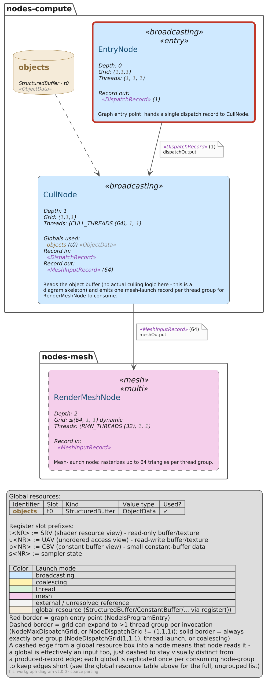
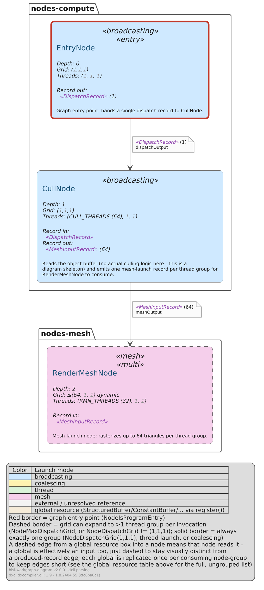

# mesh-culling

A `broadcasting` node reads an object-count `StructuredBuffer` global and dispatches a `mesh`-launch node
with a runtime-determined (`NodeMaxDispatchGrid`) dispatch grid.

```
EntryNode (broadcasting) ──▶ CullNode (broadcasting) ──▶ RenderMeshNode (mesh)
                                    ▲
                       objects (StructuredBuffer, t0)
```

- **`EntryNode`** - the graph's entry point, hands a single `DispatchRecord` to `CullNode`.
- **`CullNode`** - reads the `objects` buffer (`CULL_THREADS`-sized thread group, resolved from a
  `#define`) and emits one mesh-launch record per thread group for `RenderMeshNode` - no real culling
  logic, this is a diagram skeleton only.
- **`RenderMeshNode`** - a mesh-launch node, dispatch grid picked at runtime (`NodeMaxDispatchGrid(64,1,1)`
  ceiling - the dashed border in the render), rasterizing up to 64 triangles per thread group.

`src/` is the HLSL itself - node skeletons only, no real compute logic. `src/WorkGraph.hlsl` is only there
for `parse-dxil` (a single compile unit that `#include`s every node, including the mesh one);
`parse-source` never reads it, it scans `src/nodes-compute/` and `src/nodes-mesh/` directly.

## Reproducing `gen/`

```sh
# parse-source path
hlsl-workgraph-diagram parse-source src gen/work-graph.source.ir.json
hlsl-workgraph-diagram build-puml gen/work-graph.source.ir.json gen/work-graph.source.puml --global-boxes
hlsl-workgraph-diagram puml-render gen/work-graph.source.puml

# parse-dxil path (needs a dxc build - "hlsl-workgraph-diagram setup-dxil mesh" first: this graph
# needs the mesh-capable dxc build, and --dxc-version mesh is given explicitly below since the
# auto-detection heuristic only scans the entry file's own text, not its #includes, and
# src/WorkGraph.hlsl only reaches the mesh node through one - see docs/ir-format.md)
hlsl-workgraph-diagram parse-dxil src/WorkGraph.hlsl gen/work-graph.dxil.ir.json --dxc-version mesh
hlsl-workgraph-diagram build-puml gen/work-graph.dxil.ir.json gen/work-graph.dxil.puml --global-boxes
hlsl-workgraph-diagram puml-render gen/work-graph.dxil.puml
```

Run from inside `examples/mesh-culling/`. `gen/` keeps both parsers' full output side by side:
`work-graph.{source,dxil}.{ir.json,puml,png,svg}`. `--global-boxes` on both `build-puml` calls draws the
`objects` global as its own box with a dashed edge into the node that reads it (see the side-by-side render
below for why it only appears in one of the two).

## Differences between the two renders

Every node, edge, launch mode, resolved value, comment, and record parameter's own variable name matches
exactly between the two. The one real difference, and it's a significant one:

- **`objects` (the `StructuredBuffer` global) is entirely absent from the `parse-dxil` render** - no box,
  no row in the legend's global resource table, nothing. `CullNode` only reads it via
  `objects.GetDimensions(count, stride)`, and never uses the result afterward - so dxc's optimizer
  dead-code-eliminates the whole call, and the compiled DXIL container ends up with no `!dx.resources`
  entry for `objects` at all. `parse-dxil` reads the *compiled* metadata, so as far as it can tell the
  global was never there. `parse-source`'s text scan has no such blind spot (finds `objects.GetDimensions`
  regardless of whether the result is used) and correctly lists it, marked used. Neither reading is
  "wrong" - `parse-source` reports "this global is referenced in the source"; `parse-dxil` reports "this
  global survived into the compiled shader" - but it's a real, visible difference in what gets drawn, not
  just a metadata footnote. See `docs/ir-format.md`'s "Global-set semantics differ" and "Known differences"
  #2.

(The very last legend line is expected to differ - it's each render's own provenance: generator, source
path, and, for `parse-dxil`, the exact `dxc` version used.)

## Side by side

| `parse-source` | `parse-dxil` |
| --- | --- |
|  |  |

Look for the `objects` database box (top-left of the `parse-source` render, feeding `CullNode`) - and its
absence on the `parse-dxil` side.
