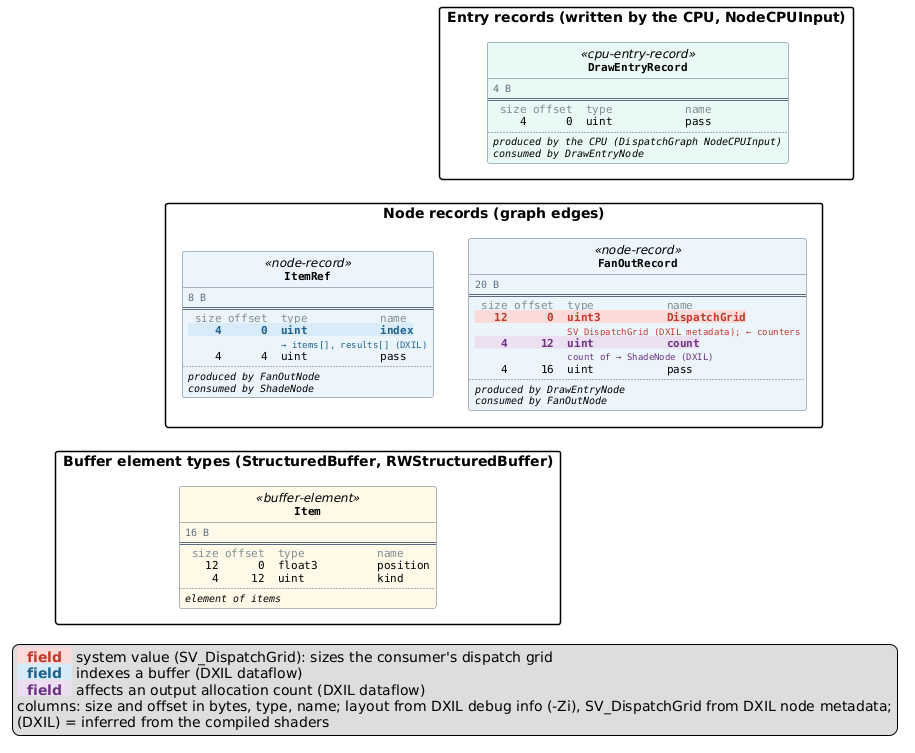

> **⚠️ LLM-GENERATED CONTENT** - review before relying on it.

# Example: multi-dispatch frame (`pipeline`)

A minimal two-stage frame, the shape of a "generate, then rasterise" renderer:

- **produce** (entry `EmitNode`): `EmitNode` emits one `ItemRecord` per item to `StoreNode`, which allocates a
  slot with an atomic add on `counters[0]` and writes the item into the `items` UAV.
- **consume-color** / **consume-stats** (entry `DrawEntryNode`, two dispatches of the same entry):
  `DrawEntryNode` reads the item count back from `counters[0]` and launches `FanOutNode` with an
  `SV_DispatchGrid` sized from it; `FanOutNode` sends one `ItemRef { index, pass }` per item to `ShadeNode`,
  which reads `items[index]` and writes `results[index]`. The entry record's `pass` selects what is written;
  the second dispatch is compiled with `WITH_STATS`, which adds an atomic statistics counter in `ShadeNode`.

The only hand-written input is [`pipeline.config.json`](pipeline.config.json) - the three dispatch definitions
(entry, entry record, defines). Everything else in `gen/` is read from the compiled DXIL.

## Reproduce `gen/`

```sh
# from the repo root; needs a dxc (setup-dxil, or add "dxc": "<path>" to the config's "compile")
node generate-workgraph-diagram.js pipeline examples/multi-dispatch/pipeline.config.json examples/multi-dispatch/gen \
    --jar path/to/plantuml.jar          # or --server <url>, or neither for .puml only
```

`gen/` was produced with the Linux dxc `libdxcompiler.so: 1.9(dev;4480-cfc8ba0c)` and PlantUML 1.2026.8.

## What to look at

| File | Shows |
| --- | --- |
| [`gen/frame.png`](gen/frame.png) | The three dispatches in order. `StoreNode` writes `items` and adds to `counters` (orange); both consumer dispatches read them (blue). Each consumer package lists its entry record (`pass = 0` / `1`) and what `pass` reaches: it is copied into `FanOutRecord.pass` and `ItemRef.pass`. Only `consume-stats` has `ShadeNode`'s atomic write to `counters`, from `WITH_STATS`. |
| [`gen/02-consume-color.graph.png`](gen/02-consume-color.graph.png) | One dispatch's node graph: Globals read only / Record in / Globals written / Record out per node. |
| [`gen/02-consume-color.records.png`](gen/02-consume-color.records.png) | Record layouts: `FanOutRecord.DispatchGrid` as SV_DispatchGrid (sourced from `counters`), `ItemRef.index` indexing `items` and `results`, `FanOutRecord.count` affecting how many `ItemRef`s `FanOutNode` emits (it also decides a branch there; the diagram shows the stronger role). |
| [`gen/validation.txt`](gen/validation.txt) | 55 pass, 0 warn, 0 fail: spec limits, record sizes, SV_DispatchGrid, every consumer-read field written, entry records valid, `items`/`counters` read only after `produce` wrote them. |

## Record layouts

Each dispatch gets its own records diagram (`gen/NN-<dispatch>.records.png`), holding the records and buffer
element types that dispatch uses. `consume-color`:



Rows read `size offset type name`. Highlights are inferred from the compiled shader: `FanOutRecord.DispatchGrid`
is the SV_DispatchGrid (red, computed from `counters`), `ItemRef.index` indexes the `items` and `results` buffers
(blue), and `FanOutRecord.count` affects how many `ItemRef`s `FanOutNode` emits (purple).

Two `compile-*.ir.json` files exist because `consume-stats` adds a define: the library is compiled once per
distinct define set.
