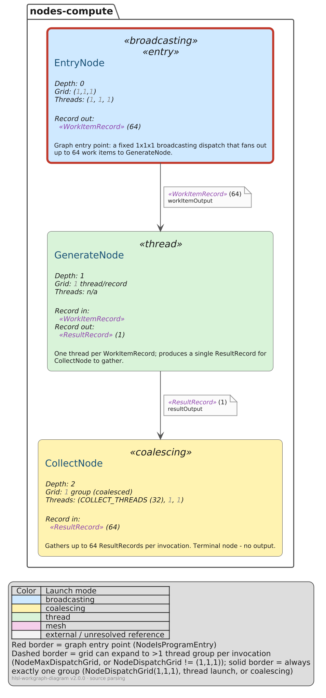
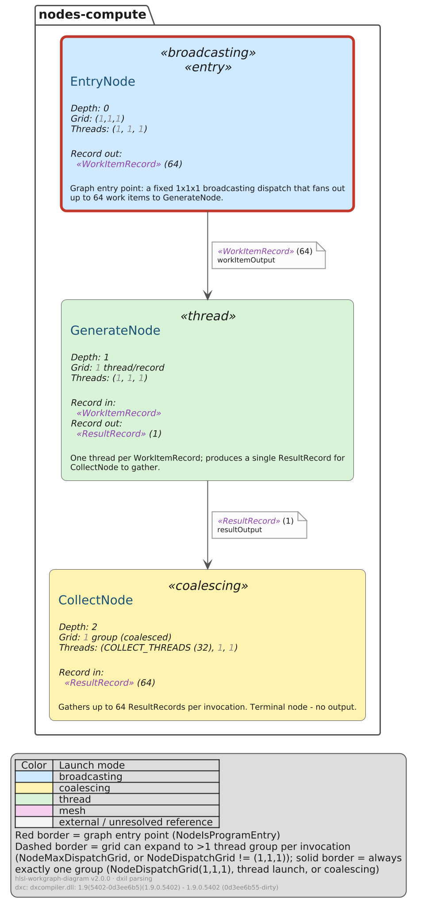

# simple-pipeline

The three main D3D12 Work Graph launch modes chained together: a `broadcasting` entry node fans out work
items to a `thread`-launch node, which each produce one result gathered by a `coalescing` node.

```
EntryNode (broadcasting) ──▶ GenerateNode (thread) ──▶ CollectNode (coalescing)
```

- **`EntryNode`** - the graph's entry point, a fixed `1x1x1` dispatch that fans out up to 64
  `WorkItemRecord`s.
- **`GenerateNode`** - one thread per `WorkItemRecord`, each producing a single `ResultRecord`.
- **`CollectNode`** - gathers up to 64 `ResultRecord`s per invocation (`COLLECT_THREADS` thread group
  size, resolved from a `#define`). Terminal node, no output.

`src/` is the HLSL itself - node skeletons only (attributes and records, no real compute logic), just
enough for the tool to have something to diagram. `src/WorkGraph.hlsl` is only there for `parse-dxil`
(a single compile unit that `#include`s every node); `parse-source` never reads it, it scans
`src/nodes-compute/` directly.

## Reproducing `gen/`

```sh
# parse-source path
hlsl-workgraph-diagram parse-source src gen/work-graph.source.ir.json
hlsl-workgraph-diagram build-puml gen/work-graph.source.ir.json gen/work-graph.source.puml
hlsl-workgraph-diagram puml-render gen/work-graph.source.puml

# parse-dxil path (needs a dxc build - "hlsl-workgraph-diagram setup-dxil" first)
hlsl-workgraph-diagram parse-dxil src/WorkGraph.hlsl gen/work-graph.dxil.ir.json
hlsl-workgraph-diagram build-puml gen/work-graph.dxil.ir.json gen/work-graph.dxil.puml
hlsl-workgraph-diagram puml-render gen/work-graph.dxil.puml
```

Run from inside `examples/simple-pipeline/`. `gen/` keeps both parsers' full output side by side:
`work-graph.{source,dxil}.{ir.json,puml,png,svg}`.

## Differences between the two renders

Everything else - every node, edge, launch mode, resolved value, comment, and (as of this tool's variable-
name recovery) every record parameter's own name - matches exactly. The one real difference:

- **`GenerateNode`'s `Threads:` line.** `parse-source` shows `Threads: n/a`, since `GenerateNode`'s HLSL
  never writes a `[NumThreads(...)]` attribute at all (thread-launch nodes don't need one). `parse-dxil`
  shows `Threads: (1, 1, 1)`, because dxc synthesizes that tag during compilation - a thread-launch node
  is *always* exactly one thread per record, so the compiler makes it explicit in the metadata even though
  the source never did. Neither is wrong: one shows what's *written*, the other what the compiler
  *resolved*. See `docs/ir-format.md`'s "Known differences" #1.

(The very last legend line is expected to differ - it's each render's own provenance: generator, source
path, and, for `parse-dxil`, the exact `dxc` version used.)

## Side by side

| `parse-source` | `parse-dxil` |
| --- | --- |
|  |  |
